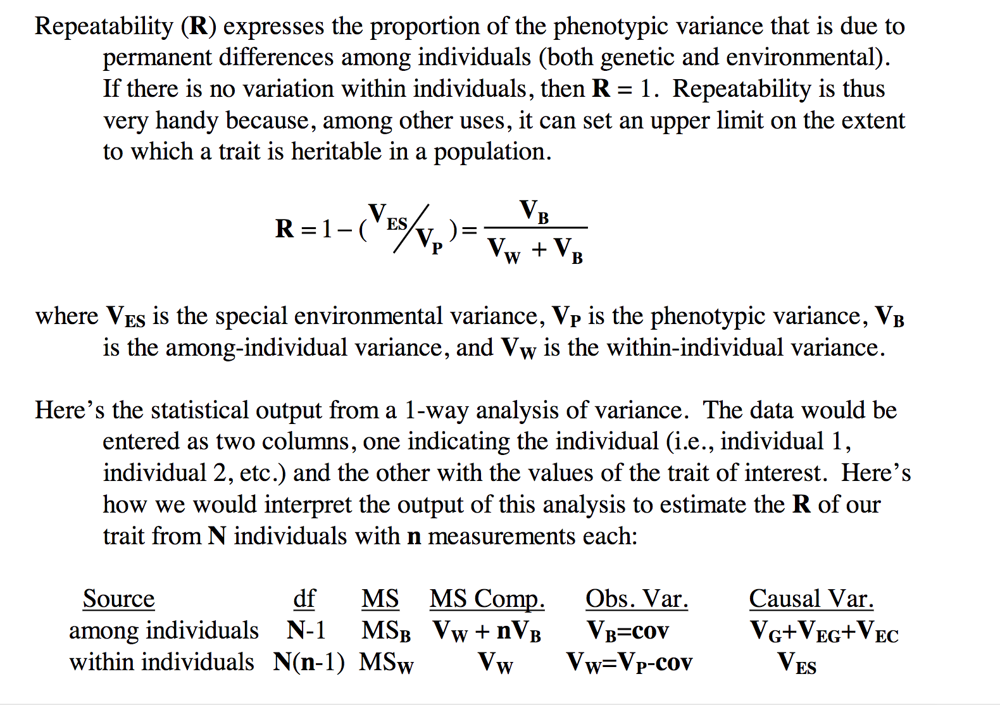
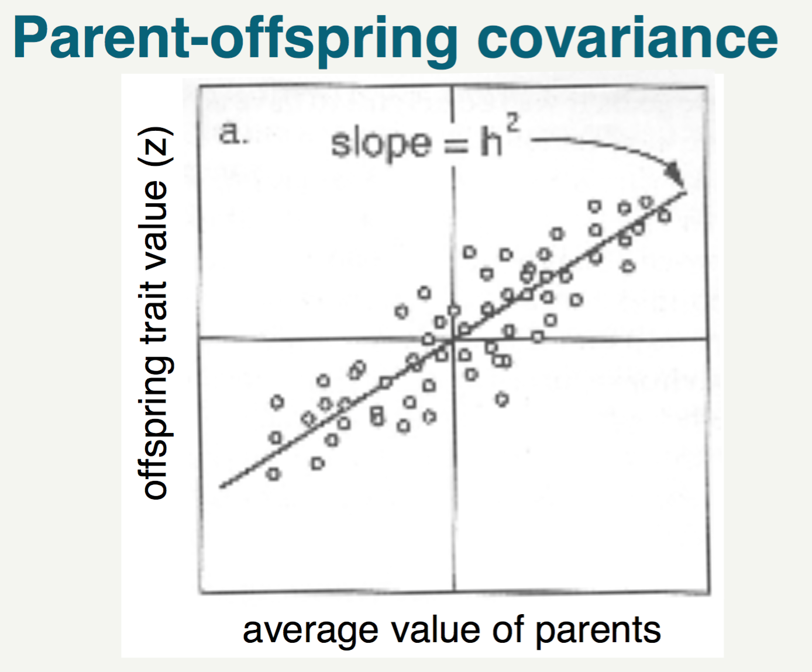
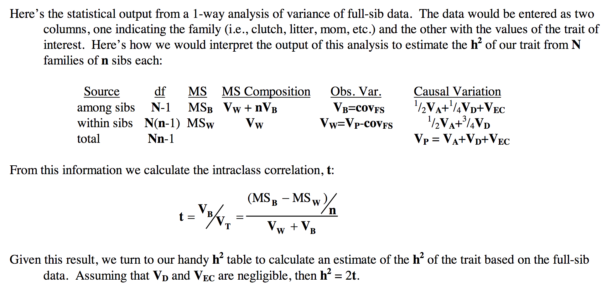

#Repeatability


```{r}
#repeated measures of the 8th primary feather from 30 turkeys 
turkey <- read.table("turkey.txt", header = TRUE, sep = "\t")
```

###Calculate means and sums of squares. These will be used in our ANOVA (analysis of variance) to determine how much variation is within individuals and how much is between individuals.
```{r}
#Means
len1mean <- mean(turkey$Length.1)
len2mean <- mean(turkey$Length.2)
len3mean <- mean(turkey$Length.3)
Xbar=(len1mean+len2mean+len3mean)/3
Xbar #this is the overall mean
```
```{r}
#SStotal=the sum of squares of all the observations from the grand mean (the difference between each observation from the grand mean), where Xbar represents the grand mean
x <- turkey[2:4]
SStotal <- sum((x-Xbar)^2)
```
```{r}
#SSBetween=the sum of squares (deviations) of the group means (in this case, each individual's mean measure of 8th primary feather length, so use the mean for each individual) from the grand mean,  where Xbar represents the grand mean
n <- 3 #number of measures for each individual
groupmeans <- apply(x, 1 , mean) #the one means to take the means across each row
SSBetween <- n*sum((groupmeans-Xbar)^2)
```
```{r}
#SSWithin=the sum of squares (deviations) of the observations from the individual means
SSWithin <- SStotal-SSBetween
```

###We have the sums of squares now. How do we get from those to MS values?
```{r}
#Calculate degrees of freedom
N <- 30 #number of individuals
n <- 3 #number of measures for each individual
df_between <- N-1
df_within <- N*(n-1)
```
```{r}
#MS values are calculated by dividing the sum of squares by the degrees of freedom:
MS_Between <- SSBetween/df_between
MS_Within <- SSWithin/df_within
```

###To calculate R, the repeatability, we need Vb and Vw. If you remember from class and the table above, MS_Within is equal to Vw (the phenotypic variance within individuals). So we now know Vw.
```{r}
Vw <- MS_Within
```
###Referencing the table above, we see that MS_Between is equal to Vw + nVb (where n is the number of measures for each individual). We can use this to figure out what Vb, the phenotypic variance between individuals, is in this dataset.
```{r}
n <- 3 #number of measures for each individual
Vb <- (MS_Between-Vw)/n
```

##Calculate R
```{r}
Vb/(Vb+Vw)
((MS_Between-MS_Within)/n)/(Vw+Vb) #alternative method
```
What does this value mean?

#Heritability

```{r}
#Flower color is a trait which seems to be important in determining pollination success. These are flower color data from a population of Hibiscus flowers in Hawaii.
hibiscus <- read.table("hibiscus.txt", header = TRUE, sep = "\t")
```

There are multiple ways to calculate heritability depending on the data you are given. The first way, which we will address here, is determining the parent-offspring phenotypic covariance. In other words, how do the offspring phenotypes change as a function of the average of the parental phenotypes? See the slide from your lecture below.

With the hibiscus data, we have the parental and the offspring phenotypes, so we should be able to generate this plot. First, let's take the average of the parental phenotypes and create another column in our dataframe.
```{r}
hibiscus$Parent.Avg <- apply(hibiscus[,2:3], 1 , mean) #creates a column with average of the parent phenotypes (columns 2 and 3 of the hibiscus dataframe)

#You should now be able to see the new column, Parent.Avg, in your hibiscus dataframe.

#Let's make a scatterplot of the data.
install.packages("reshape2")
library(reshape2)
plot_hibiscus <- hibiscus[,c(4:8)]
plot_hibiscus <- melt(plot_hibiscus, id="Parent.Avg")
plot(plot_hibiscus$Parent.Avg, plot_hibiscus$value, xlab = "Parent Average Color", ylab = "Offspring Color")
```
How can we figure out h^2 from this plot?
```{r}
lm(plot_hibiscus$Parent.Avg~plot_hibiscus$value) #perform a regression to determine the slope of the relationship
plot(plot_hibiscus$Parent.Avg, plot_hibiscus$value, xlab = "Parent Average Color", ylab = "Offspring Color")
abline(19.9007, 0.7811) #value for intercept and slope from the regression, draws the line on the plot
```
Given the results of the linear model, what is the slope? What is h^2?

##Now let's try using ANOVA to estimate heritability using the full-sibling method


Let's start in a similar manner to our approach for repeatability; we want to calculate MS_Between, MS_Within, Vw, and Vb. Our goal is to calculate t, which we can then use to find h^2, the heritability.

###Degrees of Freedom:
```{r}
N <- 20 #number of FAMILIES
n <- 4 #number of SIBLINGS
df_between <- N-1
df_within <- N*(n-1)
```
###Sums of Squares:
```{r}
#Means: we don't want to include parental data for the full-sib analysis, so we will just use columns 4-7
col1mean <- mean(hibiscus$Offspring)
col2mean <- mean(hibiscus$Offspring.1)
col3mean <- mean(hibiscus$Offspring.2)
col4mean <- mean(hibiscus$Offspring.3)
Xbar=(col1mean+col2mean+col3mean+col4mean)/4
Xbar #this is the overall mean

#SStotal
x <- hibiscus[4:7]
SStotal <- sum((x-Xbar)^2)

#SSBetween (between family sum of squares)
n <- 4 #number of siblings for each family
groupmeans <- apply(x, 1 , mean)
SSBetween <- n*sum((groupmeans-Xbar)^2)

#SSWithin (within families sum of squares)
SSWithin <- SStotal-SSBetween
```

###MS Between and Within:
```{r}
#MS values are calculated by dividing the sum of squares by the degrees of freedom:
MS_Between <- SSBetween/df_between
MS_Within <- SSWithin/df_within
```
###Vb and Vw
```{r}
Vw <- MS_Within
Vb <- (MS_Between-Vw)/n
```
```{r}
t <- ((MS_Between-MS_Within)/n)/(Vw+Vb) 
2*t
```
Do you notice any problems with our answer for heritability? What would this mean? Why do we get this result (what problems exist when using a full sib design)?
(See slide)

Will our results for heritability stay the same if we investigate a wild population of hibiscus instead?

#Response to Selection
Now that we know h^2 (let's use our first estimate that is more reliable, 0.7811), can we determine the mean color of the future generation if we selected a subset of hibiscus to be the parents? What is the equation we would use?

```{r}
new_parent_mean <- mean(hibiscus[(hibiscus$Parent.Avg>=95),8])
S <- new_parent_mean-mean(hibiscus$Parent.Avg) #mean of selected breeding parents vs the original mean of the population = selection differential
h2 <- 0.7811
S*h2
```
What does this value mean? What would be the new mean value for color?
```{r}
mean(hibiscus$Parent.Avg) #original population mean
mean(hibiscus$Parent.Avg) + (S*h2) #new mean of color for future generation
```
```{r}
plot(plot_hibiscus$Parent.Avg, plot_hibiscus$value, xlab = "Parent Average Color", ylab = "Offspring Color", col = ifelse(hibiscus$Parent.Avg>=95, "green", "black"))
abline(h=mean(hibiscus$Parent.Avg), col = "red")
abline(v=mean(hibiscus$Parent.Avg), col = "blue")
abline(v=new_parent_mean, col = "blue", lty = 3)
abline(h=mean(hibiscus$Parent.Avg) + (S*h2), col = "red", lty = 3)
```


